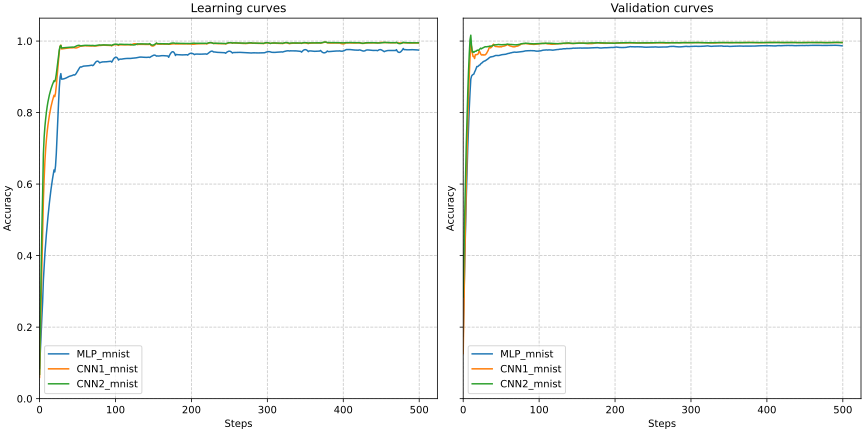
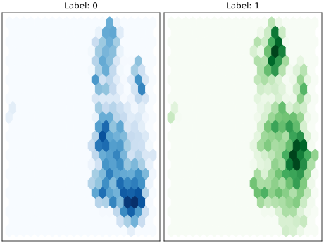
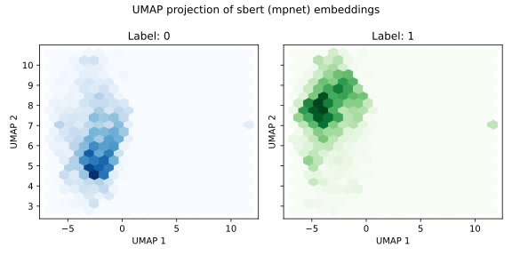
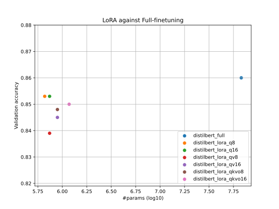

# Deep learning applications

Repository to host the laboratories from the course on Deep Learning Applications. We conver topics ranging from Computer Vision, Natural Language Processing and then Adversarial Learning.


## :test_tube: Lab1 - Convolutional Neural Networks

Feel for working with deep models

Inspect experiments from my [comet_ml](https://www.comet.com/david-inf/deep-learning-applications) project

<details>
<summary>Code organization</summary>

```bash
pip install -r lab1.txt
```

- `ckpts/` folder that will be automatically created for storing model checkpoints, this uses `torch.save()`
- `configs/` folder that will be automatically created for storing `yaml` configurations files for each experiment
  - `generate_configs.py` automatically generate a configuration file from a given params dict
  - Each model configuration will be stored in `configs/model/`
- `models/` module with MLPs (`mlp.py`) and CNNs (`cnn.py` `resnet.py` `wideresnet.py`) definitions
- `plots/` for results
- `utils/` module with utilities (`misc.py` and `train.py`)
- `cmd_args.py` arguments for main programs
- `mydata.py` wrappers for MNIST and CIFAR10 datasets, augmentations are available too
- `train.py` `distill.py` training utilities for standard training and knowledge distillation training
- Main programs:
  - `main_train.py` main script for training a single model, see `python lab1/main_train.py --help`
  - `main_distill.py` main script for distilling knowledge, see `python lab1/main_distill.py --help`

</details>

<details>
<summary>Running the main programs</summary>

Before running check always if the configuration file is correct (as for the device).

```bash
python lab1/main_train.py --config lab1/configs/CNN/MediumCNN.yaml --view
```

```bash
python lab1/main_train.py --config lab1/configs/CNN/MediumCNN.yaml
```

```bash
001: 100%|█████████████████████████| 391/391 [00:30<00:00, 12.92batch/s, train_acc=0.342, train_loss=1.73, val_acc=0.379, val_loss=1.78]
002: 100%|█████████████████████████| 391/391 [00:37<00:00, 10.32batch/s, train_acc=0.5, train_loss=1.37, val_acc=0.535, val_loss=1.28]
003: 100%|█████████████████████████| 391/391 [00:39<00:00,  9.91batch/s, train_acc=0.586, train_loss=1.15, val_acc=0.597, val_loss=1.16]
```

```bash
python lab1/main_distil.py --config lab1/configs/Distil/DistilCNN_RN32.yaml
```

```bash
001: 100%|████████████████████████| 391/391 [00:13<00:00, 28.11batch/s, train_acc=0.326, train_loss=2.32, val_acc=0.413, val_loss=1.62]
002: 100%|████████████████████████| 391/391 [00:12<00:00, 31.35batch/s, train_acc=0.472, train_loss=1.74, val_acc=0.497, val_loss=1.49]
003: 100%|████████████████████████| 391/391 [00:12<00:00, 31.09batch/s, train_acc=0.537, train_loss=1.48, val_acc=0.55, val_loss=1.27]
```

</details>


### :zero: Warming up on MNIST

Train a MLP and a two CNNs on the MNIST dataset. I chose to train two CNNs because one has fewer params than the dataset samples, the other has more, as the MLP. Maybe something shows up idk.

<details>
<summary>MLP architecture</summary>

The simplest version in which you give as argument a list with hidden unit sizes `layer_sizes=[512, 512, 512]` like in this example. On top of this another linear layer that ends with the number of classes.

```python
layers = []
layers.append(nn.Linear(input_size, layer_sizes[0]))
layers.append(nn.ReLU(inplace=True))
for i in range(len(layer_sizes) - 1):
    layers.append(nn.Linear(layer_sizes[i], layer_sizes[i + 1]))
    layers.append(nn.ReLU(inplace=True))
self.mlp = nn.Sequential(*layers)

self.classifier = nn.Linear(layer_sizes[-1], num_classes)
```

- `python lab1/main_train.py --config lab1/configs/MLP/MLP_mnist.yaml --view`

</details>

<details>
<summary>CNNs architecture</summary>

This architecture follows the concept of the ResNet in which we have "macro-layers" each one with a variable number of blocks.

- `input_adapter`: conv + batchnorm + relu that exits with `num_filters`
- `blocks`: fixed number of layers with variable `BasicBlock` blocks
  - Each `BasicBlock` contains two modules of conv + batchnorm + relu
  - Each layer contains $n$ `BasicBlock`, in the default version $n=1$ (this is specified via the `num_blocks` argument)
  - Optional skip connection in each block by setting `skip=True` (for residual learning comparison)
- `avgpool`: ends with a `(num_filters*2) x 1 x 1` feature map
- `classifier`: classification head

Here we use 2 macro-layers, resulting in `2*2*n+2` total layers.

- `python lab1/main_train.py --config lab1/configs/CNN/CNN1.yaml --view` where `num_blocks=2` and `num_filters=32`
- `python lab1/main_train.py --config lab1/configs/CNN/CNN2.yaml --view` where `num_blocks=2` and `num_filters=64`

</details>

<details>
<summary>Results</summary>

Model  | #params
------ | -----
`MLP`  | 0.93M
`CNN1` | 0.17M
`CNN2` | 0.68M

<p align="middle">
  
</p>

</details>


### :one: Degradation problem, deep residual learning

Reproducing on a small scale the results from the ResNet paper on CIFAR10 dataset.

> Deep Residual Learning for Image Recognition. He *et al*. [Arxiv](https://arxiv.org/abs/1512.03385).

Deeper networks, i.e. more stacked layers, do not guarantee more reduction in training loss. So the point of this exercise is to abstract a model definition so that one can add a given number of layers (blocks), and then see how the performance are affected. The idea is to reproduce Figure 6 from the paper.

<details>
<summary>Results</summary>

| Model           | `num_blocks` | `num_filters` | #params | Layers | val_acc |
| --------------- | ------------ | ------------- | ------- | ------ | ------- |
| `SmallCNN`      | 1            | 16            | 0.02M   | 6      | 0.7091  |
| `SmallCNNskip`  | 1            | 16            | 0.02M   | 6      | 0.6891  |
| `MediumCNN`     | 5            | 16            | 0.11M   | 22     | 0.7418  |
| `MediumCNNskip` | 5            | 16            | 0.11M   | 22     | 0.7975  |
| `LargeCNN`      | 7            | 16            | 0.16M   | 30     | 0.6916  |
| `LargeCNNskip`  | 7            | 16            | 0.16M   | 30     | 0.8034  |

<p align="middle">
  
</p>

When adding further layers we see that "adding more layers reduces loss" holds no more. Skip connections, residual learning, solve the problem. Validation accuracy provides evidence as well, i.e. skip connections solve the degradation problem.

</details>


### :two: Knowledge Distillation

Reproducing on a small scale the results from the distillation paper on CIFAR10 dataset.

> Distilling the Knowledge in a Neural Network. Hinton *et al*. [Arxiv](https://arxiv.org/abs/1503.02531).

<details>
<summary>Learning algorithm</summary>

For a given $x$ the frozen teacher and the trainable students both produce logits, the idea is to align the
student's output with the teacher's one.

Loss:
- Soft targets loss $\mathcal{L}_1$: `KLDivLoss(log_target=True, reduction="batchmean")(soft_prob, soft_targets)`
- Hard targets loss $\mathcal{L}_2$: `CrossEntropyLoss()(student_logits, labels)`
- Final loss: $\mathcal{L}=w_1\mathcal{L}_1+w_2\mathcal{L}_2$ with $w_1\gg w_2$ which important to ensure that the knowledge distillation training outperforms that standard training

As the teacher model we use the actual `ResNet` architecture with 3 blocks of `BasicBlock` blocks resulting in
$3n+2$ total layers. Also the same algorithm is applied to the `WideResNet` model (same architecture with pre-activation `BasicBlock`).

- `python lab1/main_train.py --config lab1/configs/ResNet/ResNet32.yaml --view`
- `python lab1/main_train.py --config lab1/configs/WideResNet/WideResNet14-2.yaml --view`

</details>

<details>
<summary>Results</summary>

We define another CNN, named BaseCNN, with skip connections and to have more #params than dataset samples. Here we'd like to compare BaseCNN with standard training and knowledge distillation training. We compare also the two teachers (also warly stopping was applied).

| Name                 | `num_blocks` | `num_filters` | `widen_factor` | #params | Layers | val_acc |
| -------------------- | ------------ | ------------- | -------------- | ------- | ------ | ------- |
| `ResNet32`           | 5            | 16            | 1              | 0.47M   | 32     | 0.8420  |
| `WideResNet14-2`     | 2            | 16            | 2              | 0.69M   | 14     | 0.8500  |
| `BaseCNN`            | 1            | 32            | 1              | 0.08M   | 6      | 0.7690  |
| `DistilCNN_RN32`     | 1            | 32            | 1              | 0.08M   | 6      | 0.7116  |
| `DistilCNN_WRN14-2`  | 1            | 32            | 1              | 0.08M   | 6      | 0.8007  |

<p align="middle">
  
  &nbsp;
  
</p>

The distilled model is able to achieve a higher train accuracy earlier. Mostly similar performance on the validation set, however the distilled model stays on top of the base one. The small model trained with distillation has better performance than the same trained in the classical way! And WideResNet outperforms ResNet on both comparisons.

</details>


## :test_tube: Lab3 - Transformers and NLP

Work with the `HuggingFace` ecosystem to adapt models to new tasks.

<details>
<summary>Code organization</summary>

```bash
python install -r lab3.txt
```

- `ckpts/` model checkpoints using `.save_pretrained()` method
- `configs/` configuration files automatically generated using `generate_configs.py` program
- `models/` wrappers for BERT-family models
- `results/` plotted stuffs
- `utils/` module with various utilities inside `misc.py` and `train.py`
- `cmd_args.py` main programs' arguments
- `load_and_eval.py` load the test dataset and perform inference with a given model checkpoint
- `main_extract.py` main program for obtaining baseline results with a given pretrained extractor, i.e. a BERT-family model from the local `models` module
- `main_ft.py` core of this lab that is the main program for finetuning a pretrained BERT-family model
- `mydata.py` utilities for preprocessing and loading the `rotten_tomatoes` dataset from HuggingFace
- `train.py` train loop

Try `python lab3/main_extract.py --help` and `python lab3/main_ft.py --help`. You'll see that for `main_ft.py` there's the `--view` argument available, that allows to inspect a model given its configuration file via the `--config` argument.

</details>


### :one: BERT as a feature extractor

Train a simple classifier (LinearSVC) on top of BERT sentence representation for sentiment analysis task, this will be the baseline which we will try to improve with finetuning. See code in `lab3/main_extract.py`.


<details>
<summary>Results</summary>

We use the rotten tomatoes dataset with train-val-test splits, hence we use the BERT-family models as feature extractors, then we train a LinearSVC classifier on top of the representation. We compare DistilBERT (`[CLS]` token and mean pooling) and SentenceBERT (two models) extractors.

- `python lab3/main_extract.py --extract --extractor distilbert --method cls`
- `python lab3/main_extract.py --extract --extractor distilbert --method mean`
- `python lab3/main_extract.py --extract --extractor sbert --method minilm`
- `python lab3/main_extract.py --extract --extractor sbert --method mpnet`

The `--extract` argument is needed for saving the features locally, this makes possible to train different classifiers on top of those features.

| Extractor for LinearSVC                   | size  | `train_acc` | `val_acc` | `test_acc` |
| ----------------------------------------  | ----- | ----------- | --------- | ---------- |
| `distilbert-base-uncased` (`[CLS]` token) | 67M   | 0.849       | 0.822     | 0.798      |
| `distilbert-base-uncased` (mean pooling)  | 67M   | 0.846       | 0.810     | 0.788      |
| `sentence-transformers/all-MiniLM-L6-v2`  | 22.7M | 0.791       | 0.767     | 0.777      |
| `sentence-transformers/all-mpnet-base-v2` | 109M  | 0.879       | 0.855     | 0.847      |

Being SBERT more suitable than DistilBERT for producing sentence embeddings, as we expected the classifier on top of SBERT has better performance.

</details>


<details>
<summary>Visualize embeddings</summary>

Here we load the features extracted before and visualize them in a 2D space using the UMAP method, see `view_embeds()` function from `lab3/main_extract.py`.-

```bash
python lab3/main_extract.py --extractor distilbert --method cls  --view
python lab3/main_extract.py --extractor sbert --method mpnet --view
```

<p align="middle">
  
  &nbsp;
  
</p>

Here we see the expressive power of SBERT against DistilBERT :)

</details>


### :two: BERT Finetuning

The goal now is to improve over the baseline performance. For doing this we proceed with a full finetuning and see what happens. Then we seek for a more efficient way for finetuning BERT on the rotten tomatoes dataset using `PEFT` library. See code in `lab3/main_ft.py`.

The idea is to perform model selection on BERT-family models (full-finetuning and few LoRA configs) for the text classification task, then we deploy the best BERT on the test split. So I'd like to reproduce results from figure 2 of the original LoRA paper

> LoRA: Low-Rank Adaptation of Large Language Models. Hu *et al*. [Arxiv](https://arxiv.org/abs/2106.09685).

<details>
<summary>Finetuning settings</summary>

So we compare the full-finetuning and few LoRA configurations, for defining these configurations we use the following matrix, since the two questions are (i) do we need to update all the parameters? (ii) how expressive should the updates be?

| params/rank | 8            | 16            |
| ----------- | ------------ | ------------- |
| **q**       | `lora_q8`    | `lora_q16`    |
| **qv**      | `lora_qv8`   | `lora_qv16`   |
| **qkvo**    | `lora_qkvo8` | `lora_qkvo16` |

Launch finetuning with commands like

- `python lab3/main_ft.py --config lab3/configs/distilbert_full.yaml`
- `python lab3/main_ft.py --config lab3/configs/distilbert_lora_q16.yaml`

| Model                    | #params (log10) | val_acc |
| ------------------------ | --------------- | ------- |
| `distilbert_full`        | 7.83            | 0.860   |
| `distilbert_lora_q8`     | 5.82            | 0.853   |
| `distilbert_lora_q16`    | 5.87            | 0.853   |
| `distilbert_lora_qv8`    | 5.87            | 0.839   |
| `distilbert_lora_qv16`   | 5.95            | 0.845   |
| `distilbert_lora_qkvo8`  | 5.95            | 0.848   |
| `distilbert_lora_qkvo16` | 6.07            | 0.850   |

</details>


<details>
<summary>Results</summary>

<p align="middle">
  
</p>

</details>


<details>
<summary>Deploy on onseen data</summary>

Obviously the full-finetuned DistilBERT has the better performance, and since the finetuning isn't that expensive yet, `distilbert_full` will be deployed on unseed data from rotten tomatoes dataset, i.e. the test split.

```bash
python lab3/load_and_eval.py --split test --config lab3/configs/distilbert_full.yaml
```


</details>
