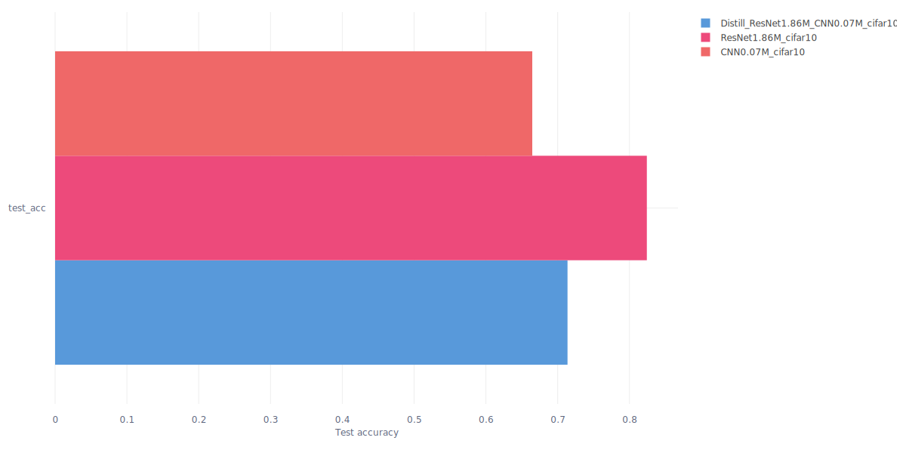

# Deep learning applications

Repository to host the laboratories from the course on deep learning applications

## :test_tube: Lab1 - Convolutional Neural Networks

Feel for working with deep models

<details>
<summary>Code organization</summary>

Inside folder `lab1/` you have the follwing programs:
- `checkpoints` folder that will be automatically created for storing model checkpoints
- `experiments` folder that will be automatically created for storing yaml configurations files for each experiment
- `models/` folder with MLPs (`mlp.py`) and CNNs (`cnn.py`) definitions
- `cmd_args.py` arguments for main programs
- `config-train.yaml` `config-distill.yaml` base configuration files
- `generate_configs.py` program for generating yaml configuration files automatically from base configuration files and given options
- Main programs:
  - `main-train.py` main script for training a single model
  - `main-distill.py` main script for distilling knowledge
  - `main-models.py` main script for inspecting models defined in `models/` folder
- `mydata.py` wrappers for MNIST and CIFAR10 datasets
- `train.py` and `utils.py` are utilities

</details>

<details>
<summary>Running the main script</summary>

After generating configs, run a program with
```{bash}
python lab1.py experiments/CNN_4.83M_cifar10.yaml
```

It will automatically save checkpoints and log to `comet_ml`. If the experiment have already been runned, you may run the same command with more epochs (`--epochs 40`) and the experiment will be resumed (checkpoint path and experiment key are automatically dumped in the configuration file).

When running a program you should see
```{bash}
030: 100%|██████████████████████| 338/338 [00:02<00:00, 112.93batch/s, train_acc=0.997, train_loss=0.0669, val_acc=0.538, val_loss=1.97]
031: 100%|██████████████████████| 338/338 [00:03<00:00, 112.49batch/s, train_acc=0.998, train_loss=0.0619, val_acc=0.533, val_loss=1.97]
032: 100%|██████████████████████| 338/338 [00:03<00:00, 106.86batch/s, train_acc=0.998, train_loss=0.0583, val_acc=0.534, val_loss=1.98]
```

</details>

### :one: Skip connections, deep residual learning

Reproducing on a small scale the results from the ResNet paper using CIFAR10 dataset.

> Deep Residual Learning for Image Recognition, Kaiming He and Xiangyu Zhang and Shaoqing Ren and Jian Sun, 2015. [Arxiv](https://arxiv.org/abs/1512.03385).

Deeper networks, i.e. more stacked layers, do not guarantee more reduction in training loss. So the point of this exercise is to abstract a model definition so that one can add a given number of layers (blocks), and then see how the performance are affected. The idea is to reproduce Figure 6 from the paper.

<details>
<summary>MLP</summary>

MLP with variable number of blocks `n_blocks`:
- `BasicBlock`: 2 fully connected layers with given `hidden_size` and relu
- Optional skip connection in each block by setting `skip=True`

</details>

<details>
<summary>CNN</summary>

- `input_adapter`: conv + batchnorm + relu that exits with `num_filters`
- `blocks`: sequence of `BasicBlock` layers
  - Each `BasicBlock` contains two modules of conv + batchnorm + relu
  - In this version there are two upper level layers, each one with $n$ `BasicBlock`, in the default version $n=1$
  - Optional shortcut in each block by setting `skip=True`
- `avgpool`: ends with a (1, 1) feature map
- `fc`: classification head

This results in $4n+2$ layers, where $n$ is the variable specifying the number of blocks per each layer. In the implementation $n$ is specified through the `num_blocks`parameter.

</details>

<details>
<summary>Results</summary>

Name | $n$ | Filters | Layers | Test acc
---- | --- | ------- | ------- | --------
`TinyCNN 0.02M` | 1 | 16 | 6 | 0.6737
`SmallCNN 0.07M` | 3 | 16 | 14 | 0.6646
`MediumCNN 0.11M` | 5 | 16 | 22 | 0.5999
`MediumCNN w/ skip 0.11M` | 5 | 16 | 22 | 0.7393
`LargeCNN 0.16M` | 7 | 16 | 30 | 0.5095
`LargeCNN w/ skip 0.16M` | 7 | 16 | 30 | 0.7505

Learning curves | Test accuracy
--- | ---
 | 
See the degradation problem for increasing depth of the network, tiny and medium have similar performance, but when adding further layers we see that "adding more layers reduces loss" holds no more. Skip connections, residual learning, solve the problem. | Test accuracy provides evidence as well, i.e. skip connections solve the degradation problem.

</details>

### :two: Knowledge Distillation

Reproducing on a small scale the results from the distillation paper using CIFAR10 dataset.

> Distilling the Knowledge in a Neural Network, Geoffrey Hinton, Oriol Vinyals, Jeff Dean. [Arxiv](https://arxiv.org/abs/1503.02531).

<details>
<summary>Learning algorithm</summary>

For a given $x$ the frozen teacher and the trainable students both produce logits, the idea is to align the student's output with the teachers' one.

Loss:
- Soft targets loss $\mathcal{L}_1$: `KLDivLoss(log_target=True)(soft_prob, soft_targets)`
- Hard targets loss $\mathcal{L}_2$: `CrossEntropyLoss()(student_logits, labels)`
- Final loss: $\mathcal{L}=w_1\mathcal{L}_1+w_2\mathcal{L}_2$ with $w_1\gg w_2$

As the teacher model we use the actual `ResNet` architecture with 3 blocks of `BasicBlock` layers resulting in $3n+2$ total layers

</details>

<details>
<summary>Results</summary>

Name | $n$ | Filters | Layers | Test acc
---- | --- | ------- | ------ | --------
`SmallCNN 0.07M` | 3 | 16 | 14 | 0.6646
`ResNet 1.86M` | 5 | 32 | 17 | 0.8242
`Distilled SmallCNN 0.07M` | 3 | 16 | 14 | 0.7137

Learning curves | Validation curves | Test accuracy
--- | --- | ---
 |  | 
The distilled model is able to achieve a higher train accuracy earlier. | Similar performance most of the time, however the distilled model stays on top of the base one | Goal achieved! The small model trained with distillation has better performance than the same trained in the classical way

</details>


## :test_tube: Lab3 - Transformers and NLP

Work with the HuggingFace ecosystem to adapt models to new tasks.

<details>
<summary>Code organization</summary>

Inside `lab3/` folder there are the following programs:

</details>

### :one: BERT as a feature extractor

Train a simple classifier (LinearSVC) on top of BERT sentence representation for sentiment analysis task, this will be the stable baseline which we will try to improve with finetuning.

<details>
<summary>Results</summary>

We use the rotten tomatoes dataset with train-val-test splits, hence we use BERT as feature extractor, then we train a LinearSVC on top of the representation. We compare DistilBERT and SentenceBERT.

Run the program with `python main_extract.py --model "bert"` and `--model "sbert"`

Extractor | `train_acc` | `val_acc` | `test_acc`
--- | --- | --- | ---
`distilbert-base-uncased` | 0.849 | 0.822 | 0.798
`all-mpnet-base-v2` | 0.879 | 0.855 | 0.847

Being SBERT more suitable than BERT for sentence embeddings, as we expected the SVM on top of SBERT has better results. Feature extraction implementation in `feature_extractors.py`.

</details>
