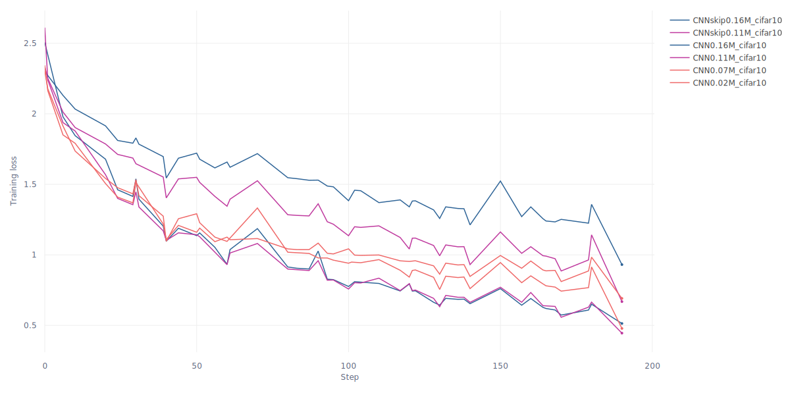
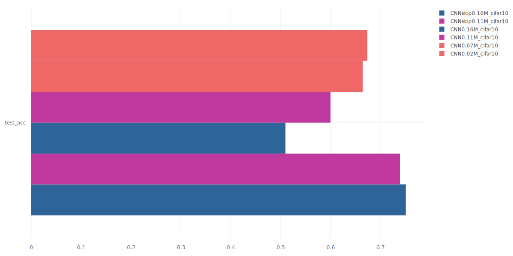
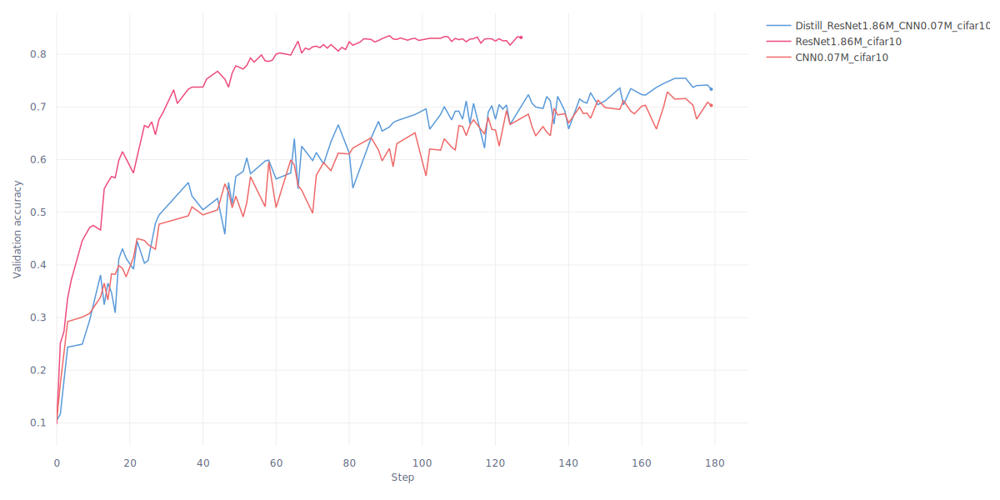

# Deep learning applications

Repository to host the laboratories from the course on Deep Learning Applications


## :test_tube: Lab1 - Convolutional Neural Networks

Feel for working with deep models

<details>
<summary>Code organization</summary>

```bash
pip install -r lab1.txt
```

- `ckpts/` folder that will be automatically created for storing model checkpoints
- `configs/` folder that will be automatically created for storing `yaml` configurations files for each experiment
  - `generate_configs.py` automatically generate a configuration file from a given params dict
  - Each model configuration will be stored in `configs/model/`
- `models/` module with MLPs (`mlp.py`) and CNNs (`cnn.py` `resnet.py`) definitions
- `plots/` for results
- `utils/` module with utilities (`misc_utils.py` and `train_utils.py`)
- `cmd_args.py` arguments for main programs
- `config-distill.yaml` base configuration files
- Main programs:
  - `main-train.py` main script for training a single model, see `python lab1/main-train.py --help`
  - `main-distill.py` main script for distilling knowledge, see `python lab1/main-distill.py --help.py`
- `mydata.py` wrappers for MNIST and CIFAR10 datasets
- `train.py` training utilities

</details>

<details>
<summary>Running the main script</summary>

Before running check always the configuration file (as for the device).

```bash
python lab1/main_train.py --config lab1/configs/CNN/MediumCNN.yaml
```

```bash
001: 100%|█████████████████████████| 391/391 [00:30<00:00, 12.92batch/s, train_acc=0.342, train_loss=1.73, val_acc=0.379, val_loss=1.78]
002: 100%|█████████████████████████| 391/391 [00:37<00:00, 10.32batch/s, train_acc=0.5, train_loss=1.37, val_acc=0.535, val_loss=1.28]
003: 100%|█████████████████████████| 391/391 [00:39<00:00,  9.91batch/s, train_acc=0.586, train_loss=1.15, val_acc=0.597, val_loss=1.16]
```

```bash
python lab1/main_distil.py --config lab1/configs/Distil/DistilCNN_RN32.yaml
```

```bash
001: 100%|████████████████████████| 391/391 [00:13<00:00, 28.11batch/s, train_acc=0.326, train_loss=2.32, val_acc=0.413, val_loss=1.62]
002: 100%|████████████████████████| 391/391 [00:12<00:00, 31.35batch/s, train_acc=0.472, train_loss=1.74, val_acc=0.497, val_loss=1.49]
003: 100%|████████████████████████| 391/391 [00:12<00:00, 31.09batch/s, train_acc=0.537, train_loss=1.48, val_acc=0.55, val_loss=1.27]
```

</details>

### :one: Degradation problem, deep residual learning

Reproducing on a small scale the results from the ResNet paper using CIFAR10 dataset.

> Deep Residual Learning for Image Recognition, Kaiming He and Xiangyu Zhang and Shaoqing Ren and Jian Sun, 2015. [Arxiv](https://arxiv.org/abs/1512.03385).

Deeper networks, i.e. more stacked layers, do not guarantee more reduction in training loss. So the point of this exercise is to abstract a model definition so that one can add a given number of layers (blocks), and then see how the performance are affected. The idea is to reproduce Figure 6 from the paper.

<details>
<summary>CNNs architecture</summary>

- `input_adapter`: conv + batchnorm + relu that exits with `num_filters`
- `blocks`: sequence of `BasicBlock` layers
  - Each `BasicBlock` contains two modules of conv + batchnorm + relu
  - In this version there are two upper level layers, each one with $n$ `BasicBlock`, in the default version $n=1$
  - Optional shortcut in each block by setting `skip=True` (this for comparison)
- `avgpool`: ends with a `(num_filters*2) x 1 x 1` feature map
- `classifier`: classification head

This results in `2*2*n+2` layers, where $n$ is the variable specifying the number of `BasicBlock` per each layer. In the implementation $n$ is specified through the `num_blocks` argument.

</details>

<details>
<summary>Results</summary>

First a table with each model

| Name            | `num_blocks` | `num_filters` | #params | Layers | val_acc |
| --------------- | ------------ | ------------- | ------- | ------ | ------- |
| `SmallCNN`      | 1            | 16            | 0.02M   | 6      | 0.      |
| `SmallCNNskip`  | 1            | 16            | 0.02M   | 6      | 0.      |
| `MediumCNN`     | 5            | 16            | 0.11M   | 22     | 0.      |
| `MediumCNNskip` | 5            | 16            | 0.11M   | 22     | 0.      |
| `LargeCNN`      | 7            | 16            | 0.16M   | 30     | 0.      |
| `LargeCNNskip`  | 7            | 16            | 0.16M   | 30     | 0.      |

Then learning curves where we can see the degradation problem

<p align="middle">
  
  &nbsp;
  
</p>

See the degradation problem for increasing depth of the network, tiny and medium have similar performance, but when adding further layers we see that "adding more layers reduces loss" holds no more. Skip connections, residual learning, solve the problem. Test accuracy provides evidence as well, i.e. skip connections solve the degradation problem.

</details>

### :two: Knowledge Distillation

Reproducing on a small scale the results from the distillation paper using CIFAR10 dataset.

> Distilling the Knowledge in a Neural Network, Geoffrey Hinton, Oriol Vinyals, Jeff Dean.
[Arxiv](https://arxiv.org/abs/1503.02531).

<details>
<summary>Learning algorithm</summary>

For a given $x$ the frozen teacher and the trainable students both produce logits, the idea is to align the
student's output with the teachers' one.

Loss:
- Soft targets loss $\mathcal{L}_1$: `KLDivLoss(log_target=True)(soft_prob, soft_targets)`
- Hard targets loss $\mathcal{L}_2$: `CrossEntropyLoss()(student_logits, labels)`
- Final loss: $\mathcal{L}=w_1\mathcal{L}_1+w_2\mathcal{L}_2$ with $w_1\gg w_2$

As the teacher model we use the actual `ResNet` architecture with 3 blocks of `BasicBlock` layers resulting in
$3n+2$ total layers

</details>

<details>
<summary>Results</summary>

We define another CNN, named BaseCNN, with skip connectiona and to have more #params than dataset samples. Here we'd like to compare BaseCNN with standard training and knowledge distillation training. We compare also the two teachers.

| Name                 | `num_blocks` | `num_filters` | `widen_factor` | #params | Layers | val_acc |
| -------------------- | ------------ | ------------- | -------------- | ------- | ------ | ------- |
| `BaseCNN`            | 1            | 32            | 1              | 0.08M   | 6      | 0.      |
| `ResNet32`           | 5            | 16            | 1              | 0.47M   | 32     | 0.      |
| `WideResNet14-2`     | 2            | 16            | 2              | 0.69M   | 14     | 0.      |
| `DistilCNN_RN32`     | 1            | 16            | 1              | 0.08M   | 6      | 0.      |
| `DistilCNN_WRN14-2`  | 1            | 16            | 1              | 0.08M   | 6      | 0.      |

<p align="middle">
  
  &nbsp;
  
</p>

The distilled model is able to achieve a higher train accuracy earlier. Mostly similar performance on the validation set, however the distilled model stays on top of the base one. The small model trained with distillation has better performance than the same trained in the classical way!

</details>


## :test_tube: Lab3 - Transformers and NLP

Work with the HuggingFace ecosystem to adapt models to new tasks.

<details>
<summary>Code organization</summary>

```bash
python install -r lab3.txt
```

Inside `lab3/` folder there are the following programs:

- Exercise 1:
  - `main_extract.py`
- Exercise 2:
  - `main_ft.py`

</details>

### :one: BERT as a feature extractor

Train a simple classifier (LinearSVC and LogisticRegression) on top of BERT sentence representation for sentiment analysis task, this will be the stable baseline which we will try to improve with finetuning. See code in `main_extract.py`.

<details>
<summary>Results</summary>

We use the rotten tomatoes dataset with train-val-test splits, hence we use the BERT models as feature extractors, then we train LinearSVC and LogisticRegression classifiers on top of the representation. We compare DistilBERT and SentenceBERT extractors.

- `python lab3/main_extract.py --extractor "distilbert" --method "cls" --classifier "svm"`
- `python lab3/main_extract.py --extractor "distilbert" --method "mean" --classifier "svm"`
- `python lab3/main_extract.py --extractor "sbert" --method "mpnet" --classifier "svm"`
- `python lab3/main_extract.py --extractor "sbert" --method "minilm" --classifier "svm"`

| Extractor for LinearSVC                  | size  | `train_acc` | `val_acc` | `test_acc` |
| ---------------------------------------- | ----- | ----------- | --------- | ---------- |
| `distilbert-base-uncased` ([CLS] token)  | 67M   | 0.849       | 0.822     | 0.798      |
| `distilbert-base-uncased` (mean pooling) | 67M   | 0.846       | 0.810     | 0.788      |
| `all-mpnet-base-v2`                      | 109M  | 0.879       | 0.855     | 0.847      |
| `all-MiniLM-L6-v2`                       | 22.7M | 0.791       | 0.767     | 0.777      |

- `python lab3/main_extract.py --extractor "distilbert" --method "cls" --classifier "logistic"`
- `python lab3/main_extract.py --extractor "distilbert" --method "mean" --classifier "logistic"`
- `python lab3/main_extract.py --extractor "sbert" --method "mpnet" --classifier "logistic"`
- `python lab3/main_extract.py --extractor "sbert" --method "minilm" --classifier "logistic"`

| Extractor for LogisticRegression         | size  | `train_acc` | `val_acc` | `test_acc` |
| ---------------------------------------- | ----- | ----------- | --------- | ---------- |
| `distilbert-base-uncased` ([CLS] token)  | 67M   | 0.840       | 0.822     | 0.794      |
| `distilbert-base-uncased` (mean pooling) | 67M   | 0.841       | 0.817     | 0.792      |
| `all-mpnet-base-v2`                      | 109M  | 0.863       | 0.859     | 0.852      |
| `all-MiniLM-L6-v2`                       | 22.7M | 0.784       | 0.777     | 0.774      |

Being SBERT more suitable than BERT for sentence embeddings, as we expected the classifier on top of SBERT has better performance.

</details>


### :two: BERT Finetuning

The goal now is to improve over the baseline performance. For doing this we proceed with a full finetuning and see what happens.


### :three: PEFT study on BERT

Efficient way for finetuning BERT on rotten tomatoes dataset using `PEFT` library
