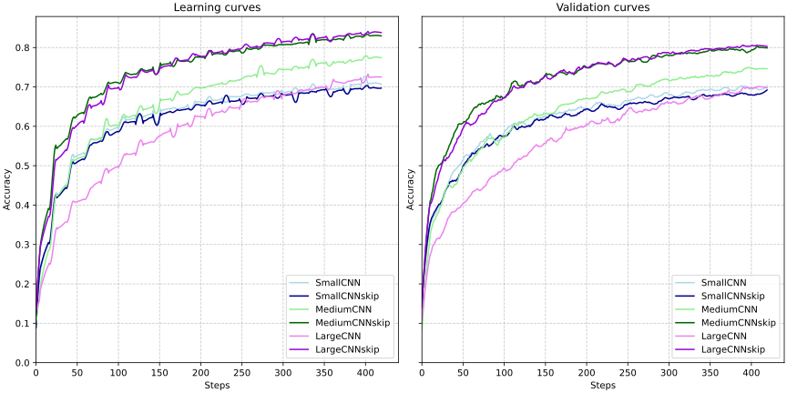
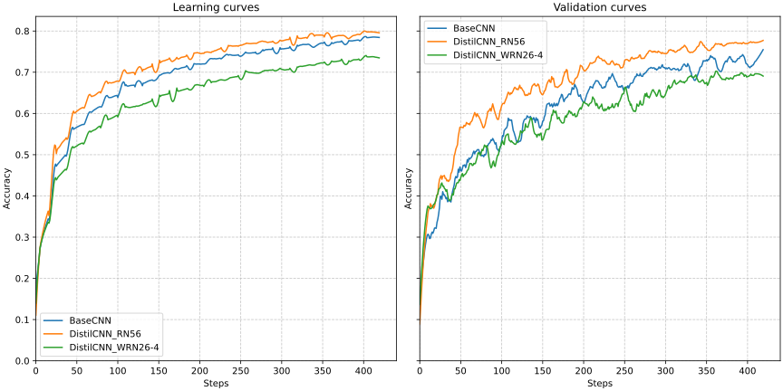
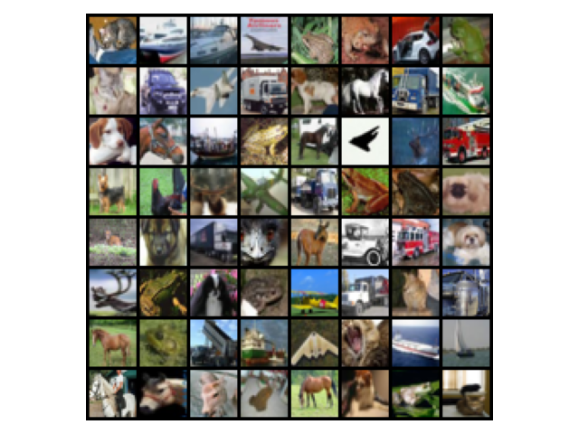
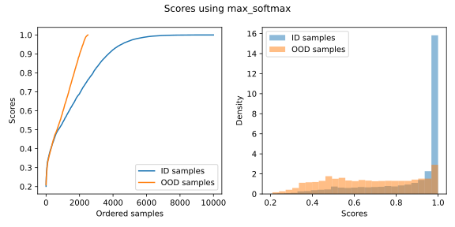
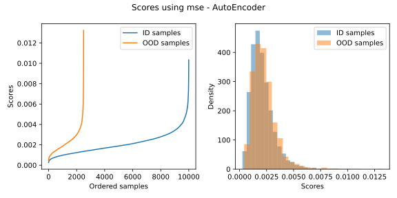
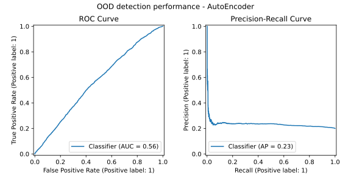
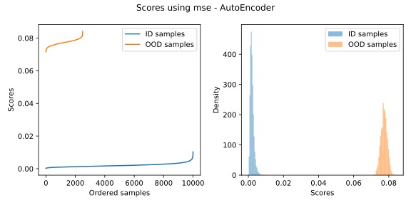
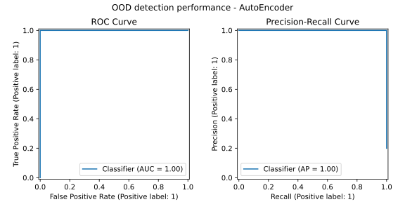
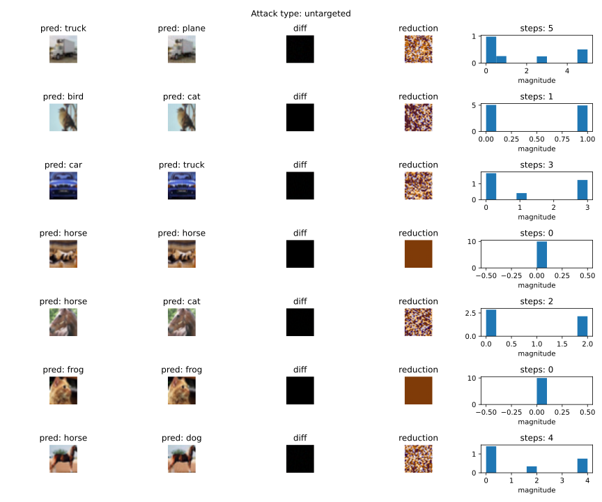
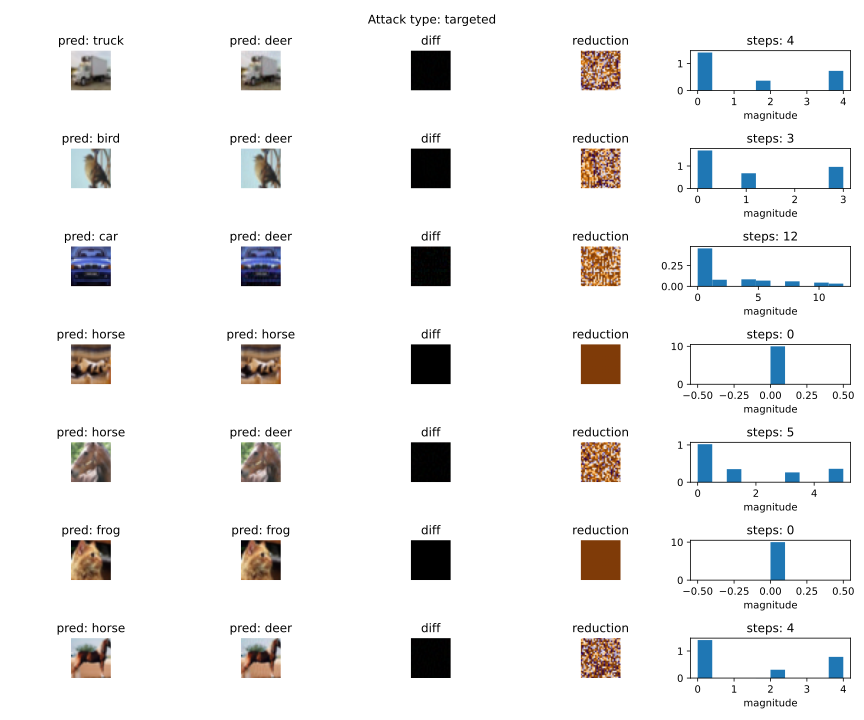

# Deep learning applications

Repository to host the laboratories from the course on Deep Learning Applications


## :test_tube: Lab1 - Convolutional Neural Networks

Feel for working with deep models

<details>
<summary>Code organization</summary>

```bash
pip install -r lab1.txt
```

- `ckpts/` folder that will be automatically created for storing model checkpoints
- `configs/` folder that will be automatically created for storing `yaml` configurations files for each experiment
  - `generate_configs.py` automatically generate a configuration file from a given params dict
  - Each model configuration will be stored in `configs/model/`
- `models/` module with MLPs (`mlp.py`) and CNNs (`cnn.py` `resnet.py` `wideresnet.py`) definitions
- `plots/` for results
- `utils/` module with utilities (`misc_utils.py` and `train_utils.py`)
- `cmd_args.py` arguments for main programs
- Main programs:
  - `main_train.py` main script for training a single model, see `python lab1/main_train.py --help`
  - `main_distill.py` main script for distilling knowledge, see `python lab1/main_distill.py --help`
- `mydata.py` wrappers for MNIST and CIFAR10 datasets
- `train.py` `distill.py` training utilities for standard training and knowledge distillation training

</details>

<details>
<summary>Running the main script</summary>

Before running check always if the configuration file is correct (as for the device).

```bash
python lab1/main_train.py --config lab1/configs/CNN/MediumCNN.yaml
```

```bash
001: 100%|█████████████████████████| 391/391 [00:30<00:00, 12.92batch/s, train_acc=0.342, train_loss=1.73, val_acc=0.379, val_loss=1.78]
002: 100%|█████████████████████████| 391/391 [00:37<00:00, 10.32batch/s, train_acc=0.5, train_loss=1.37, val_acc=0.535, val_loss=1.28]
003: 100%|█████████████████████████| 391/391 [00:39<00:00,  9.91batch/s, train_acc=0.586, train_loss=1.15, val_acc=0.597, val_loss=1.16]
```

```bash
python lab1/main_distil.py --config lab1/configs/Distil/DistilCNN_RN32.yaml
```

```bash
001: 100%|████████████████████████| 391/391 [00:13<00:00, 28.11batch/s, train_acc=0.326, train_loss=2.32, val_acc=0.413, val_loss=1.62]
002: 100%|████████████████████████| 391/391 [00:12<00:00, 31.35batch/s, train_acc=0.472, train_loss=1.74, val_acc=0.497, val_loss=1.49]
003: 100%|████████████████████████| 391/391 [00:12<00:00, 31.09batch/s, train_acc=0.537, train_loss=1.48, val_acc=0.55, val_loss=1.27]
```

</details>

### :one: Degradation problem, deep residual learning

Reproducing on a small scale the results from the ResNet paper on CIFAR10 dataset.

> Deep Residual Learning for Image Recognition, Kaiming He and Xiangyu Zhang and Shaoqing Ren and Jian Sun, 2015. [Arxiv](https://arxiv.org/abs/1512.03385).

Deeper networks, i.e. more stacked layers, do not guarantee more reduction in training loss. So the point of this exercise is to abstract a model definition so that one can add a given number of layers (blocks), and then see how the performance are affected. The idea is to reproduce Figure 6 from the paper.

Inspect experiments from my [comet_ml](https://www.comet.com/david-inf/deep-learning-applications) project.

<details>
<summary>CNNs architecture</summary>

- `input_adapter`: conv + batchnorm + relu that exits with `num_filters`
- `blocks`: fixed number of layers with variable `BasicBlock` blocks
  - Each `BasicBlock` contains two modules of conv + batchnorm + relu
  - Each layer contains $n$ `BasicBlock`, in the default version $n=1$ (this is specified via the `num_blocks` argument)
  - Optional skip connection in each block by setting `skip=True` (for residual learning comparison)
- `avgpool`: ends with a `(num_filters*2) x 1 x 1` feature map
- `classifier`: classification head

Here we use 2 (macro-)layers, resulting in `2*2*n+2` total layers.

- `python lab1/main_train.py --config lab1/configs/CNN/MediumCNN.yaml --view` for model inspection (no training with the `--view` argument)

</details>

<details>
<summary>Results</summary>

| Model           | `num_blocks` | `num_filters` | #params | Layers | val_acc |
| --------------- | ------------ | ------------- | ------- | ------ | ------- |
| `SmallCNN`      | 1            | 16            | 0.02M   | 6      | 0.7091  |
| `SmallCNNskip`  | 1            | 16            | 0.02M   | 6      | 0.6891  |
| `MediumCNN`     | 5            | 16            | 0.11M   | 22     | 0.7418  |
| `MediumCNNskip` | 5            | 16            | 0.11M   | 22     | 0.7975  |
| `LargeCNN`      | 7            | 16            | 0.16M   | 30     | 0.6916  |
| `LargeCNNskip`  | 7            | 16            | 0.16M   | 30     | 0.8034  |

<p align="middle">
  
</p>

When adding further layers we see that "adding more layers reduces loss" holds no more. Skip connections, residual learning, solve the problem. Validation accuracy provides evidence as well, i.e. skip connections solve the degradation problem.

</details>

### :two: Knowledge Distillation

Reproducing on a small scale the results from the distillation paper on CIFAR10 dataset.

> Distilling the Knowledge in a Neural Network, Geoffrey Hinton, Oriol Vinyals, Jeff Dean.
[Arxiv](https://arxiv.org/abs/1503.02531).

<details>
<summary>Learning algorithm</summary>

For a given $x$ the frozen teacher and the trainable students both produce logits, the idea is to align the
student's output with the teacher's one.

Loss:
- Soft targets loss $\mathcal{L}_1$: `KLDivLoss(log_target=True, reduction="batchmean")(soft_prob, soft_targets)`
- Hard targets loss $\mathcal{L}_2$: `CrossEntropyLoss()(student_logits, labels)`
- Final loss: $\mathcal{L}=w_1\mathcal{L}_1+w_2\mathcal{L}_2$ with $w_1\gg w_2$

As the teacher model we use the actual `ResNet` architecture with 3 blocks of `BasicBlock` blocks resulting in
$3n+2$ total layers. Also the same algorithm is applied to the `WideResNet` model (same architecture with pre-activation `BasicBlock`).

- `python lab1/main_train.py --config lab1/configs/ResNet/ResNet32.yaml --view`
- `python lab1/main_train.py --config lab1/configs/WideResNet/WideResNet14-2.yaml --view`

</details>

<details>
<summary>Results</summary>

We define another CNN, named BaseCNN, with skip connections and to have more #params than dataset samples. Here we'd like to compare BaseCNN with standard training and knowledge distillation training. We compare also the two teachers (also warly stopping was applied).

| Name                 | `num_blocks` | `num_filters` | `widen_factor` | #params | Layers | val_acc |
| -------------------- | ------------ | ------------- | -------------- | ------- | ------ | ------- |
| `ResNet32`           | 5            | 16            | 1              | 0.47M   | 32     | 0.8420  |
| `WideResNet14-2`     | 2            | 16            | 2              | 0.69M   | 14     | 0.8500  |
| `BaseCNN`            | 1            | 32            | 1              | 0.08M   | 6      | 0.7690  |
| `DistilCNN_RN32`     | 1            | 32            | 1              | 0.08M   | 6      | 0.7116  |
| `DistilCNN_WRN14-2`  | 1            | 32            | 1              | 0.08M   | 6      | 0.8007  |

<p align="middle">
  
  &nbsp;
  
</p>

The distilled model is able to achieve a higher train accuracy earlier. Mostly similar performance on the validation set, however the distilled model stays on top of the base one. The small model trained with distillation has better performance than the same trained in the classical way! And WideResNet outperforms ResNet on both comparisons.

</details>


## :test_tube: Lab3 - Transformers and NLP

Work with the HuggingFace ecosystem to adapt models to new tasks.

<details>
<summary>Code organization</summary>

```bash
python install -r lab3.txt
```

Inside `lab3/` folder there are the following programs:

- Exercise 1:
  - `main_extract.py`
- Exercise 2:
  - `main_ft.py`

</details>

### :one: BERT as a feature extractor

Train a simple classifier (LinearSVC and LogisticRegression) on top of BERT sentence representation for sentiment analysis task, this will be the stable baseline which we will try to improve with finetuning. See code in `main_extract.py`.

<details>
<summary>Results</summary>

We use the rotten tomatoes dataset with train-val-test splits, hence we use the BERT models as feature extractors, then we train LinearSVC and LogisticRegression classifiers on top of the representation. We compare DistilBERT and SentenceBERT extractors.

- `python lab3/main_extract.py --extractor "distilbert" --method "cls" --classifier "svm"`
- `python lab3/main_extract.py --extractor "distilbert" --method "mean" --classifier "svm"`
- `python lab3/main_extract.py --extractor "sbert" --method "mpnet" --classifier "svm"`
- `python lab3/main_extract.py --extractor "sbert" --method "minilm" --classifier "svm"`

| Extractor for LinearSVC                  | size  | `train_acc` | `val_acc` | `test_acc` |
| ---------------------------------------- | ----- | ----------- | --------- | ---------- |
| `distilbert-base-uncased` ([CLS] token)  | 67M   | 0.849       | 0.822     | 0.798      |
| `distilbert-base-uncased` (mean pooling) | 67M   | 0.846       | 0.810     | 0.788      |
| `all-mpnet-base-v2`                      | 109M  | 0.879       | 0.855     | 0.847      |
| `all-MiniLM-L6-v2`                       | 22.7M | 0.791       | 0.767     | 0.777      |

Being SBERT more suitable than BERT for producing sentence embeddings, as we expected the classifier on top of SBERT has better performance.

</details>


### :two: BERT Finetuning

The goal now is to improve over the baseline performance. For doing this we proceed with a full finetuning and see what happens.


### :three: PEFT study on BERT

Efficient way for finetuning BERT on rotten tomatoes dataset using `PEFT` library


## :test_tube: Lab4 - Adversarial Learning

<details>
<summary>Code organization</summary>

```bash
pip install -r lab1.txt
```

Inside the `lab4/` folder there are the following programs

- `ckpts/`
- `models/` with `autoencoder.py`
- `plots/`
  - Results from OOD detection on CIFAR100 subsets (aquatic mammals and people) and FakeData
- `utils/` various utilities
- `main_detection.py` main program for launching the OOD detection pipeline on the given dataset from `lab4/mydata.py`
- `mydata.py` various datasets for OOD detection
- `train.py` main program for training the AutoEncoder on CIFAR10 dataset

</details>


### :one: OOD detection pipeline

<details>
<summary>ID and OOD samples</summary>

We choose as in-distribution (ID) dataset CIFAR10 (10000 samples from test split), and few out-of-distribution (OOD) datasets
- **aquatic mammals** subset from CIFAR100 (2500 samples from train split) `python lab4/mydata --ood aquatic`
- **people** subset from CIFAR100 `python lab4/mydata --ood people`
- **noise** generate from FakeData dataset `python lab4/mydata --ood noise`

<table>
  <caption>CIFAR10, CIFAR100 (aquatic mammals), CIFAR100 (people), and FakeData
  <tr>
    <td></td>
    <td></td>
    <td></td>
    <td></td>
  </tr>
</table>

</details>

<details>
<summary>AutoEncoder</summary>

Train the AE using `python lab4/train_ae.py --config lab4/ckpts/autoencoder.yaml`. This autoencoder is trained to reconstruct ID samples, so when passing an OOD sample, the MSE computes like a distance from its ID version, hence higher the MSE, higher the chance of being OOD - this will be the metric for detecting OOD samples.

The AE outputs with a sigmoid, so images needs to be in [0,1] already, as done in the lab1 exercises.

</details>

<details>
<summary>OOD detection pipeline</summary>

OOD detection pipeline for all the OOD datasets chosen, see `python lab4/main_detection.py --help`, plot data with `python lab4/mydata.py`. Do this by changing the code in `lab4/mydata.py` default: FakeData since is the only one dataset in which the AutoEncoder seems to work well. I would say that the method doesn't work on the two CIFAR100 subsets since CIFAR10 is a subset as well, and the distribution might be the same regardless of being different classes.

```bash
chmod +x ./lab4/detection_pipeline.sh
./lab4/detection_pipeline.sh
```

<table>
  <caption>Performance on CIFAR100 aquatic mammals subset</caption>
  <tr>
    <td></td>
    <td></td>
    <td></td>
  </tr>
  <tr>
    <td></td>
    <td></td>
    <td></td>
  </tr>
</table>

<table>
  <caption>Performance on CIFAR100 people subset</caption>
  <tr>
    <td></td>
    <td></td>
    <td></td>
  </tr>
  <tr>
    <td></td>
    <td></td>
    <td></td>
  </tr>
</table>

<table>
  <caption>Performance on FakeData</caption>
  <tr>
    <td></td>
    <td></td>
    <td></td>
  </tr>
  <tr>
    <td></td>
    <td></td>
    <td></td>
  </tr>
</table>

</details>


### :two: Adversarial attacks

Now we move to adversarial attacks by visualizing few attacks

<details>
<summary>Attacks</summary>

Run the shell script that contains commands for running an untargeted and targeted attacks

```bash
chmod +x ./lab4/adversarial.sh
./lab4/adversarial.sh
```

<table>
  <caption>Targeted and untarged attacks
  <tr>
    <td></td>
    <td></td>
  </tr>
</table>

</details>


### :three: Enhancing robustness to adversarial attacks

Enhancing the base model robustness to adversarial attacks, the idea is to train again the base model but this time the dataset is augmented with untargeted adversarial attacks. By doing this the base model robustness to adversarial attacks, as we saw in :one:, should increase and with `max_logit` and `max_softmax` the model should be able to detect adversarial examples.

<details>
<summary>Results</summary>

```bash
chmod +x ./lab4/adversarial_training.sh
```

This script runs the full pipeline that comprises the adversarial training to obtain the model `RobustCNN` then the OOD detection pipeline.

</details>
